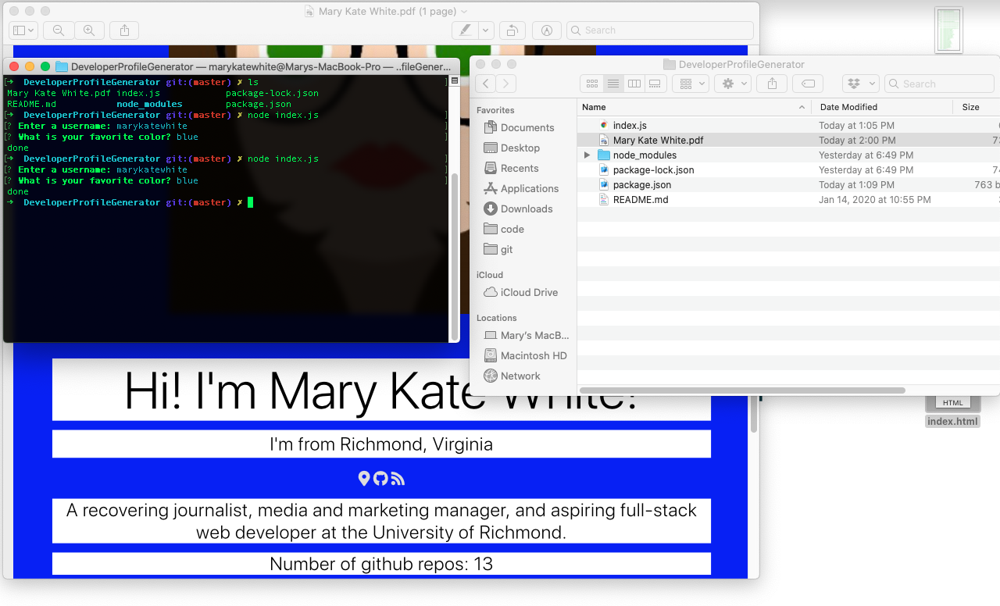

# DeveloperProfileGenerator

A command-line application that dynamically generates a PDF profile from a GitHub username. The application is invoked in the command line, prompting the user for a GitHub username and their favorite color. The generated PDF displays data from the desired GitHub user's profile, including their profile image, the name, links to their location, their GitHub profile and their "blog", as well as their bio, number of public repositores, number of followers, number of GitHub stars, and the number of users they are following.

All of the text on the PDF will be black type on a white background (for readability) while those white boxes of text are laid over a background of the uesr's choosing.

For some reason, my app runs so slowly that I literally cannot produce a GIF of it in action. Generating a profile lakes like literally almost up to a minute. I do not know why this is, but here's a screencap of it after it worked (very slowly):

## Commit Early and Often

It seems I still do not have a firm grasp of commiting. I really messed up in a big and funny way this time. I feel even more scared commiting to GitHub now.